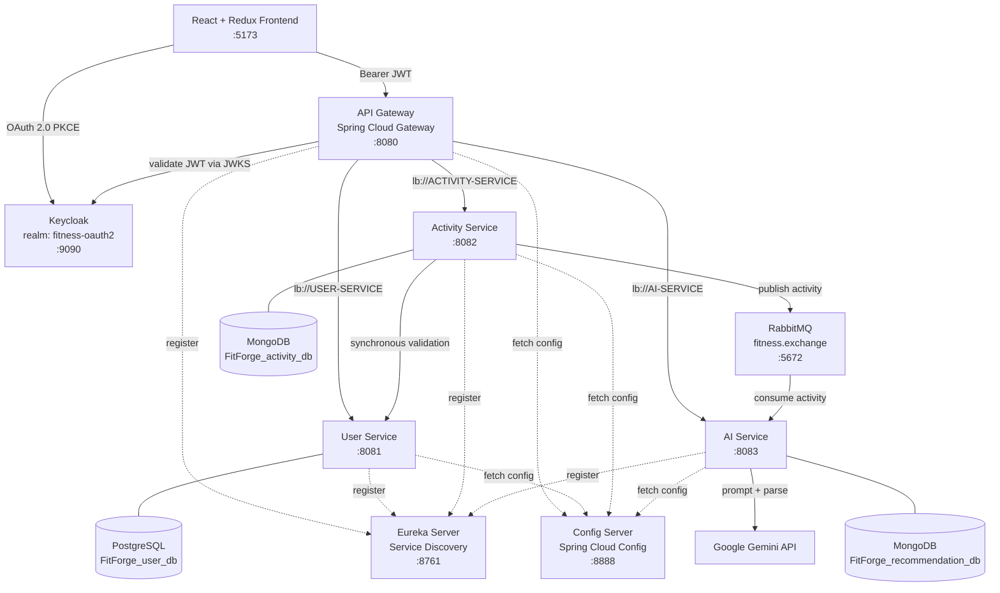
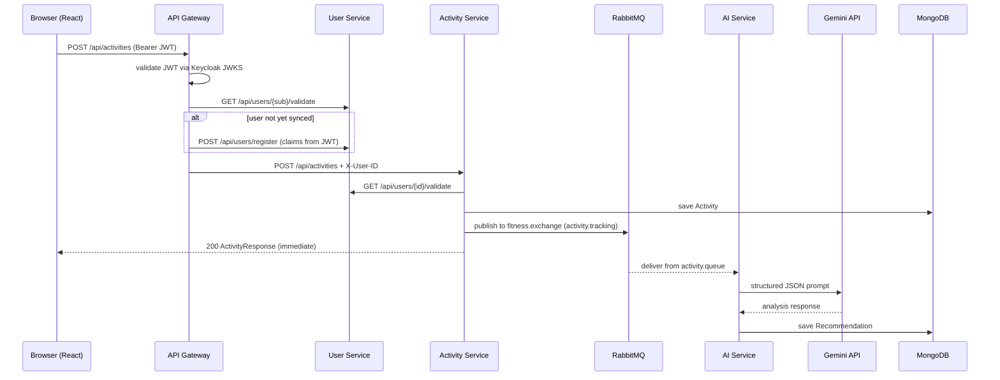

# FitForge AI

**A distributed systems fitness platform built as six Spring Boot microservices, with asynchronous AI-powered workout recommendations.**

FitForge AI lets a user log a workout and receive a personalized, AI-generated analysis of it — performance breakdown, improvement areas, suggested follow-up workouts, and safety guidance. The interesting part isn't the fitness tracking; it's the distributed systems architecture underneath it: service discovery, centralized configuration, an API gateway with OAuth 2.0, message-driven decoupling between ingestion and AI inference, and polyglot persistence across PostgreSQL and MongoDB.

---

## Table of Contents

- [Architecture](#architecture)
- [Distributed Systems Design](#distributed-systems-design)
- [Tech Stack](#tech-stack)
- [Services](#services)
- [Request Flows](#request-flows)
- [Data Models](#data-models)
- [API Reference](#api-reference)
- [Configuration](#configuration)
- [Getting Started](#getting-started)
- [Running the Platform](#running-the-platform)
- [Project Structure](#project-structure)
- [Design Notes](#design-notes)
- [Roadmap](#roadmap)

---

## Architecture



---

## Distributed Systems Design

This project is deliberately structured as a distributed system rather than a monolith, and each piece of infrastructure exists to solve a specific distributed systems problem:

| Concern | Problem | Solution in FitForge |
|---|---|---|
| **Service discovery** | Services can't hardcode each other's hosts and ports in a dynamic environment | **Netflix Eureka**. Every service registers itself on startup; callers resolve peers by logical name (`lb://USER-SERVICE`, `http://USER-SERVICE`) through a `@LoadBalanced` `WebClient` |
| **Configuration management** | Six services with overlapping config (Mongo URIs, Rabbit credentials, Eureka zone, ports) drift apart if each owns its own file | **Spring Cloud Config Server** in `native` mode, serving per-service YAML from a single classpath location. Each service ships a three-line bootstrap `application.yaml` and pulls the rest at startup |
| **Single entry point / edge routing** | Exposing four services directly to the browser means four CORS policies, four auth checks, and leaked topology | **Spring Cloud Gateway** on `:8080`. Path predicates route `/api/users/**`, `/api/activities/**`, `/api/recommendations/**` to discovery-resolved backends |
| **Authentication & identity propagation** | Every downstream service would otherwise need to parse and verify JWTs | **Keycloak + OAuth 2.0 PKCE**. The gateway is the resource server: it validates the JWT against Keycloak's JWKS endpoint, extracts the `sub` claim, and injects a trusted `X-User-ID` header downstream |
| **Temporal decoupling** | AI inference takes seconds; making the user wait on a Gemini round trip ties up a request thread and couples ingestion availability to a third-party API | **RabbitMQ**. `POST /api/activities` persists and returns immediately after publishing to `fitness.exchange`; the AI service consumes off `activity.queue` and processes on its own schedule |
| **Failure isolation** | An AI service outage shouldn't break activity logging | The publish is wrapped in a try/catch that logs and continues; the durable queue buffers messages while the consumer is down. Gemini parse failures fall back to a safe default recommendation instead of throwing |
| **Polyglot persistence** | Users are relational and transactional; activities and recommendations are schemaless, nested, and write-heavy | **PostgreSQL** for users (JPA/Hibernate), **MongoDB** for activities and recommendations (Spring Data MongoDB), with a separate database per service so no service reaches into another's storage |

---

## Tech Stack

**Backend**
- Java 25
- Spring Boot 4.0.x
- Spring Cloud 2025.1.x (Gateway, Config, Netflix Eureka, LoadBalancer)
- Spring WebFlux / reactive `WebClient` (gateway, inter-service calls)
- Spring Data JPA + Hibernate (user service)
- Spring Data MongoDB (activity + AI services)
- Spring AMQP (RabbitMQ)
- Spring Security OAuth 2.0 Resource Server (gateway)
- Lombok
- Maven (wrapper included per module)

**Frontend**
- React 19
- Redux Toolkit + React Redux
- React Router 7
- Material UI 9
- `react-oauth2-code-pkce` (Authorization Code + PKCE flow)
- Axios
- Vite

**Infrastructure**
- Keycloak (identity provider)
- RabbitMQ (message broker)
- PostgreSQL
- MongoDB
- Google Gemini API (LLM inference)

---

## Services

| Module | Service Name | Port | Datastore | Responsibility |
|---|---|---|---|---|
| `configserver` | `config-server` | `8888` | — | Serves centralized configuration to all services from `classpath:/config` |
| `eureka` | `eureka` | `8761` | — | Service registry. Does not register with itself |
| `gateway` | `api-gateway` | `8080` | — | Edge routing, JWT validation, CORS, Keycloak→user-service identity sync |
| `userservice` | `user-service` | `8081` | PostgreSQL | User registration, profile lookup, user existence validation |
| `activityservice` | `activity-service` | `8082` | MongoDB | Activity ingestion, user validation, publishing activities to RabbitMQ |
| `aiservice` | `ai-service` | `8083` | MongoDB | Consumes activities, prompts Gemini, persists and serves recommendations |
| `fitness-app-frontend` | — | `5173` | — | React SPA: login, activity form, activity list, recommendation detail |

### Config Server
Runs in `native` profile, reading YAML from `src/main/resources/config/`. Each service requests its own file by `spring.application.name`:

```
config/activity-service.yaml   →  activity-service
config/ai-service.yaml         →  ai-service
config/api-gateway.yaml        →  api-gateway
config/user-service.yml        →  user-service
```

Every client declares `spring.config.import: optional:configserver:http://localhost:8888`. The `optional:` prefix means a service will still boot (with defaults) if the config server is unreachable, which is convenient in development and something to tighten for production.

### Eureka Server
Annotated with `@EnableEurekaServer`, with `register-with-eureka: false` and `fetch-registry: false` since it is the registry itself. All four application services register here, which is what allows the gateway's `lb://` URIs and the `@LoadBalanced` `WebClient` calls to resolve.

### API Gateway
Three responsibilities, in order:

1. **`SecurityConfig`** — a WebFlux security filter chain requiring authentication on every exchange, configured as an OAuth 2.0 resource server validating JWTs against `http://localhost:9090/realms/fitness-oauth2/protocol/openid-connect/certs`. CORS is scoped to `http://localhost:5173` with `Authorization`, `Content-Type`, and `X-User-ID` allowed.
2. **`KeycloakUserSyncFilter`** — a `WebFilter` that parses the bearer token (Nimbus `SignedJWT`), extracts `sub`, `email`, `given_name`, `family_name`, checks with the user service whether that Keycloak ID already exists, and if not, registers the user. It then mutates the request to carry `X-User-ID` downstream. This means a first-time Keycloak login is transparently provisioned into the application's own user table.
3. **Routing** — declarative path predicates to load-balanced service IDs.

### User Service
Standard JPA CRUD over a `users` table with a UUID primary key, a unique email, a `keycloakId` linking to the identity provider, and `@CreationTimestamp`/`@UpdateTimestamp` auditing. `register` is idempotent: if the email already exists, the existing user is returned rather than an error being thrown — this is what makes the gateway's sync filter safe to run on every request.

### Activity Service
On `POST /api/activities`, it:
1. Calls the user service through the discovery-aware `WebClient` to validate the user exists.
2. Builds and persists an `Activity` document to MongoDB (with `@CreatedDate`/`@LastModifiedDate` auditing enabled via `@EnableMongoAuditing`).
3. Publishes the saved activity to `fitness.exchange` with routing key `activity.tracking`, serialized by a `JacksonJsonMessageConverter`.
4. Returns the response immediately — the AI work happens out of band.

### AI Service
`ActivityMessageListener` is a `@RabbitListener` on `activity.queue`. For each message it:
1. Builds a structured prompt via `ActivityAIService.createPromptForActivity()`, which instructs Gemini to respond in an **exact JSON schema** (`analysis`, `improvements`, `suggestions`, `safety`).
2. Calls Gemini through `GeminiService` using the standard `contents → parts → text` request body.
3. Parses the response: unwraps `candidates[0].content.parts[0].text`, strips markdown code fences, then parses the inner JSON.
4. Flattens the analysis sections into a readable string, extracts the improvement/suggestion/safety arrays, and saves a `Recommendation` document.
5. On any parse or API failure, falls back to `createDefaultRecommendation()` — generic safety guidance rather than a lost message.

---

## Request Flows

### Logging an activity (write path)



The user gets a response the moment the activity is durable. Everything to the right of the queue happens asynchronously — which is the whole point of putting a broker there.

### Reading a recommendation (read path)

```
Browser → GET /api/recommendations/activity/{activityId}
        → Gateway (JWT validated, X-User-ID injected)
        → lb://AI-SERVICE
        → MongoDB lookup by activityId
        → Recommendation (analysis, improvements, suggestions, safety)
```

---

## Data Models

**`User`** (PostgreSQL, table `users`)
```
id (UUID, PK) · email (unique) · keycloakId · password
firstName · lastName · role (USER | ADMIN)
createdAt · updatedAt
```

**`Activity`** (MongoDB, collection `activities`)
```
id · userId · type (ActivityType) · duration (min) · caloriesBurned
startTime · additionalMetrics (Map, stored as "metrics")
createdAt · updatedAt
```

`ActivityType`: `RUNNING`, `WALKING`, `CYCLING`, `SWIMMING`, `WEIGHT_TRAINING`, `YOGA`, `HIIT`, `CARDIO`, `STRETCHING`, `OTHER`

**`Recommendation`** (MongoDB, collection `recommendations`)
```
id · activityId · userId · activityType
recommendation (flattened analysis text)
improvements (List<String>) · suggestions (List<String>) · safety (List<String>)
createdAt
```

---

## API Reference

All routes are reached through the gateway at `http://localhost:8080` and require a valid bearer token.

### User Service — `/api/users`

| Method | Path | Description |
|---|---|---|
| `POST` | `/api/users/register` | Register a user. Idempotent on email |
| `GET` | `/api/users/{userId}` | Fetch user profile by internal ID |
| `GET` | `/api/users/{userId}/validate` | Returns `true`/`false` for a Keycloak ID |

### Activity Service — `/api/activities`

| Method | Path | Description |
|---|---|---|
| `POST` | `/api/activities` | Track a new activity. Reads `X-User-ID` header |
| `GET` | `/api/activities` | List all activities for the authenticated user |
| `GET` | `/api/activities/{activityId}` | Fetch a single activity |

Example request body:
```json
{
  "type": "RUNNING",
  "duration": 45,
  "caloriesBurned": 380,
  "startTime": "2026-01-15T07:30:00",
  "additionalMetrics": { "distanceKm": 7.2, "averageHeartRate": 148 }
}
```

### AI Service — `/api/recommendations`

| Method | Path | Description |
|---|---|---|
| `GET` | `/api/recommendations/user/{userId}` | All recommendations for a user |
| `GET` | `/api/recommendations/activity/{activityId}` | Recommendation for one activity |

---

## Configuration

### Messaging topology

| Setting | Value |
|---|---|
| Exchange | `fitness.exchange` (direct) |
| Queue | `activity.queue` (durable) |
| Routing key | `activity.tracking` |
| Converter | `JacksonJsonMessageConverter` |

Both the producer (`activityservice`) and the consumer (`aiservice`) declare the same exchange, queue, and binding, so the topology is created by whichever service starts first.

### Environment variables

The AI service resolves the Gemini credentials from the environment — they are never committed:

```bash
export GEMINI_API_URL="https://generativelanguage.googleapis.com/v1beta/models/gemini-2.0-flash:generateContent?key="
export GEMINI_API_KEY="your-api-key-here"
```

The URL and key are concatenated at call time, so `GEMINI_API_URL` must end with `?key=`.

### Datastore connection strings

Defined in the config server under `configserver/src/main/resources/config/`:

```yaml
# user-service.yml
spring.datasource.url: jdbc:postgresql://localhost:5432/FitForge_user_db

# activity-service.yaml
spring.data.mongodb.uri: mongodb://localhost:27017/FitForge_activity_db

# ai-service.yaml
spring.data.mongodb.uri: mongodb://localhost:27017/FitForge_recommendation_db
```

> Before running, replace the PostgreSQL username/password in `user-service.yml` with your own — ideally as `${DB_USERNAME}` / `${DB_PASSWORD}` environment placeholders rather than literals.

---

## Getting Started

### Prerequisites

| Requirement | Version |
|---|---|
| JDK | 25 |
| Node.js | 20+ |
| Maven | wrapper included (`./mvnw`) |
| PostgreSQL | 14+ |
| MongoDB | 6+ |
| RabbitMQ | 3.12+ (management plugin recommended) |
| Keycloak | 24+ |

### 1. Start the infrastructure

```bash
# RabbitMQ (management UI at http://localhost:15672, guest/guest)
docker run -d --name rabbitmq -p 5672:5672 -p 15672:15672 rabbitmq:3-management

# MongoDB
docker run -d --name mongodb -p 27017:27017 mongo:7

# PostgreSQL
docker run -d --name postgres -p 5432:5432 \
  -e POSTGRES_PASSWORD=yourpassword postgres:16

# Keycloak (dev mode on port 9090)
docker run -d --name keycloak -p 9090:8080 \
  -e KEYCLOAK_ADMIN=admin -e KEYCLOAK_ADMIN_PASSWORD=admin \
  quay.io/keycloak/keycloak:26.0 start-dev
```

Create the databases:
```sql
CREATE DATABASE "FitForge_user_db";
```
The Mongo databases are created on first write; Hibernate creates the `users` table via `ddl-auto: update`.

### 2. Configure Keycloak

In the admin console at `http://localhost:9090`:

1. Create a realm named **`fitness-oauth2`**.
2. Create a public client (e.g. `oauth2-pkce-client`) with:
   - **Client authentication:** off (public client)
   - **Standard flow:** enabled
   - **PKCE method:** `S256`
   - **Valid redirect URIs:** `http://localhost:5173/*`
   - **Web origins:** `http://localhost:5173`
3. Create a test user under **Users**, set a password, and mark it as non-temporary.

The gateway's JWKS URI in `api-gateway.yaml` already points at this realm — if you rename the realm or move Keycloak off `:9090`, update it there.

### 3. Set the Gemini credentials

Export `GEMINI_API_URL` and `GEMINI_API_KEY` in the shell that will run the AI service (see [Environment variables](#environment-variables)).

### 4. Create the frontend auth config

`fitness-app-frontend/src/authConfig.js` is intentionally gitignored. Create it:

```js
export const authConfig = {
  clientId: "oauth2-pkce-client",
  authorizationEndpoint:
    "http://localhost:9090/realms/fitness-oauth2/protocol/openid-connect/auth",
  tokenEndpoint:
    "http://localhost:9090/realms/fitness-oauth2/protocol/openid-connect/token",
  logoutEndpoint:
    "http://localhost:9090/realms/fitness-oauth2/protocol/openid-connect/logout",
  redirectUri: "http://localhost:5173",
  scope: "openid profile email offline_access",
  onRefreshTokenExpire: (event) => event.logIn(),
};
```

Match `clientId` to the client you created in Keycloak.

---

## Running the Platform

**Startup order matters.** Config server and Eureka must be up before the application services, since the services fetch configuration and register on boot.

```bash
# 1. Config Server  → http://localhost:8888
cd configserver && ./mvnw spring-boot:run

# 2. Eureka Server  → http://localhost:8761
cd eureka && ./mvnw spring-boot:run

# 3. User Service   → :8081
cd userservice && ./mvnw spring-boot:run

# 4. Activity Service → :8082
cd activityservice && ./mvnw spring-boot:run

# 5. AI Service      → :8083
cd aiservice && ./mvnw spring-boot:run

# 6. API Gateway     → :8080
cd gateway && ./mvnw spring-boot:run
```

```bash
# 7. Frontend        → http://localhost:5173
cd fitness-app-frontend
npm install
npm run dev
```

**Verify the system is healthy:**
- Eureka dashboard at `http://localhost:8761` should list `API-GATEWAY`, `USER-SERVICE`, `ACTIVITY-SERVICE`, and `AI-SERVICE` as `UP`.
- Config server: `curl http://localhost:8888/activity-service/default` should return the merged config.
- RabbitMQ management UI should show `fitness.exchange` bound to `activity.queue`.

**End-to-end smoke test:** log in through the frontend, submit an activity, then open that activity's detail page. The recommendation appears once the AI service has consumed the message and Gemini has responded — usually a few seconds.

---

## Project Structure

```
FitForge-AI/
├── configserver/                    # Spring Cloud Config Server (:8888)
│   └── src/main/resources/
│       ├── application.yaml         # native profile, classpath:/config
│       └── config/
│           ├── activity-service.yaml
│           ├── ai-service.yaml
│           ├── api-gateway.yaml
│           └── user-service.yml
│
├── eureka/                          # Eureka discovery server (:8761)
│   └── src/main/java/com/server/eureka/
│       └── EurekaApplication.java   # @EnableEurekaServer
│
├── gateway/                         # Spring Cloud Gateway (:8080)
│   └── src/main/java/com/fitness/gateway/
│       ├── SecurityConfig.java      # OAuth2 resource server + CORS
│       ├── KeycloakUserSyncFilter.java  # JWT → user provisioning → X-User-ID
│       └── user/                    # WebClient, DTOs, UserService proxy
│
├── userservice/                     # User service (:8081, PostgreSQL)
│   └── src/main/java/com/fitness/userservice/
│       ├── controller/UserController.java
│       ├── service/UserService.java
│       ├── repository/UserRepository.java
│       ├── model/{User, UserRole}.java
│       └── dto/{RegisterRequest, UserResponse}.java
│
├── activityservice/                 # Activity service (:8082, MongoDB)
│   └── src/main/java/com/fitness/activityservice/
│       ├── controller/ActivityController.java
│       ├── service/
│       │   ├── ActivityService.java          # persist + publish
│       │   └── UserValidationService.java    # sync call to user-service
│       ├── config/
│       │   ├── RabbitMqConfig.java           # exchange, queue, binding
│       │   ├── WebClientConfig.java          # @LoadBalanced WebClient
│       │   └── MongoConfig.java              # @EnableMongoAuditing
│       ├── model/{Activity, ActivityType}.java
│       └── dto/{ActivityRequest, ActivityResponse}.java
│
├── aiservice/                       # AI service (:8083, MongoDB)
│   └── src/main/java/com/fitness/aiservice/
│       ├── controller/RecommendationController.java
│       ├── service/
│       │   ├── ActivityMessageListener.java  # @RabbitListener
│       │   ├── ActivityAIService.java        # prompt build + response parse
│       │   ├── GeminiService.java            # Gemini HTTP client
│       │   └── RecommendationService.java
│       ├── model/{Activity, Recommendation}.java
│       └── config/{RabbitMqConfig, WebClientConfig, MongoConfig}.java
│
└── fitness-app-frontend/            # React + Redux SPA (:5173)
    └── src/
        ├── main.jsx                 # AuthProvider (PKCE) + Redux Provider
        ├── App.jsx                  # routing + auth gate
        ├── authConfig.js            # gitignored — create locally
        ├── components/
        │   ├── ActivityForm.jsx
        │   ├── ActivityList.jsx
        │   └── ActivityDetail.jsx
        ├── services/api.js          # axios + Authorization/X-User-ID interceptor
        └── store/{store.js, authSlice.js}
```

---

## Design Notes

A few decisions worth calling out, including the trade-offs:

- **The gateway owns identity, not the services.** Downstream services never parse JWTs. They trust `X-User-ID`, which is only set by the gateway filter. This keeps auth logic in one place, but it also means the services must not be reachable from outside the cluster — in a real deployment they'd sit on a private network or enforce mTLS.

- **User provisioning is lazy and idempotent.** Rather than a separate signup flow, the first authenticated request from a new Keycloak identity triggers registration from the token claims. `UserService.register()` returning the existing user on a duplicate email is what makes this safe under concurrent requests.

- **The broker is the decoupling point.** Activity ingestion has a hard latency budget (a user pressing "save"); Gemini inference does not. Putting a durable queue between them means AI-service downtime or Gemini rate limiting degrades the recommendation feature without touching the core write path.

- **Structured prompting over free-form generation.** The prompt pins Gemini to an exact JSON schema, and the parser strips markdown fences before deserializing — LLMs return fenced JSON often enough that this is a necessary defense. The `createDefaultRecommendation()` fallback means a malformed response still produces a valid document rather than an unacknowledged message.

- **Known rough edges.** `MongoConfig` in both Mongo-backed services constructs a `MongoClient` with a hardcoded URI, which bypasses the `spring.data.mongodb.uri` served by the config server; consolidating on the config-server value would make the connection string properly centralized. The `MongoDebug` components are startup diagnostics and can be removed. The `optional:` prefix on config imports should be dropped in production so a misconfigured service fails fast instead of booting with defaults.

---

## Roadmap

- [ ] Containerize every service and orchestrate the full stack with Docker Compose
- [ ] Replace native-profile config with a Git-backed config repository plus encrypted secrets
- [ ] Add a dead-letter queue and retry policy for failed AI processing
- [ ] Add resilience patterns (circuit breaker, timeout, bulkhead) on the activity → user validation call
- [ ] Distributed tracing across services (Micrometer Tracing + Zipkin/Tempo)
- [ ] Centralized structured logging and health/metrics aggregation
- [ ] Integration tests with Testcontainers for Mongo, Postgres, and RabbitMQ
- [ ] Pagination on activity and recommendation listings
- [ ] Expand the frontend activity form to cover the full `ActivityType` enum and richer metrics

---

## License

See [LICENSE](LICENSE).
